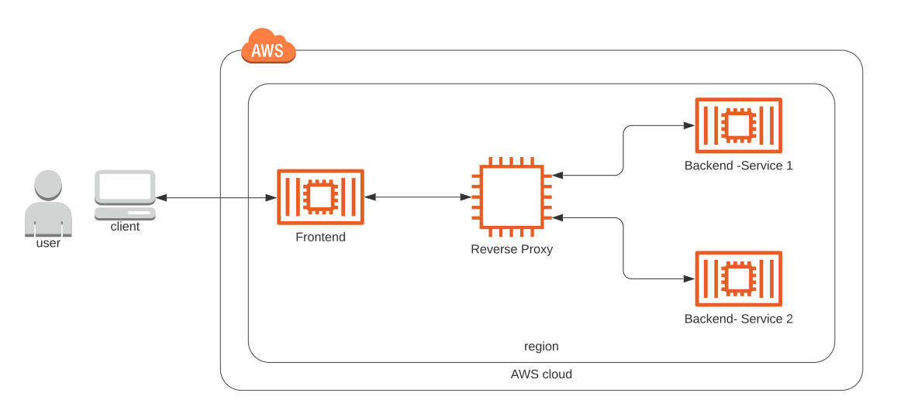

# Image Filtering Project With Microservices

Cloud application developed alongside the Udacity Cloud Engineering Nanodegree. It allows users to register and log into a web client, post photos to the feed, and process photos using an image filtering microservice.

The project is split into two parts:
1. Frontend - Angular web application built with Ionic Framework

2. Backend RESTful API - Node-Express application

   

## Getting Started
### Chosen Architecture




### Prerequisite
1. The depends on the Node Package Manager (NPM). You will need to download and install Node from [https://nodejs.com/en/download](https://nodejs.org/en/download/). This will allow you to be able to run `npm` commands.
2. Environment variables will need to be set. These environment variables include database connection details that should not be hard-coded into the application code.
3. This project uses a continuous integration tool such as travis (travis.yml), docker and kubernetes
#### Environment Script
Set the config values for environment variables through kubernetes's secrets:

`kubectl create secret generic prod-db-secret --from-literal=username=produser --from-literal=password=Y4nys7f11`

Don't forget to update the deployment.yaml specifying the environment variables declared as secrets.

### Database
Create a PostgreSQL database either locally or on AWS RDS. Set the config values for environment variables through kubernetes's secrets:

`kubectl create secret generic prod-db-secret --from-literal=username=produser --from-literal=password=Y4nys7f11`

Don't forget to update the deployment.yaml specifying the environment variables declared as secrets.

### S3
Create an AWS S3 bucket. Set the config values for environment variables through kubernetes's secrets:

`kubectl create secret generic prod-db-secret --from-literal=username=produser --from-literal=password=Y4nys7f11`

Don't forget to update the deployment.yaml specifying the environment variables declared as secrets.

### Backend API
* To download all the package dependencies, run the command from the directory `udagram-api/`:
    ```bash
    npm install .
    ```
* To run the application locally, run:
    ```bash
    npm run dev
    ```
* You can visit `http://localhost:8080/api/v0/feed` in your web browser to verify that the application is running. You should see a JSON payload. Feel free to play around with Postman to test the API's.

### Frontend App
* To download all the package dependencies, run the command from the directory `udagram-frontend/`:
    ```bash
    npm install .
    ```
    
* Install Ionic Framework's Command Line tools for us to build and run the application:
    ```bash
    npm install -g ionic
    ```
    
* Prepare your application by compiling them into static files.
    ```bash
    ionic build
    ```
    
* Run the application locally using files created from the `ionic build` command.
    ```bash
    ionic serve
    ```
    
* You can visit `http://localhost:8100` in your web browser to verify that the application is running. You should see a web interface.


